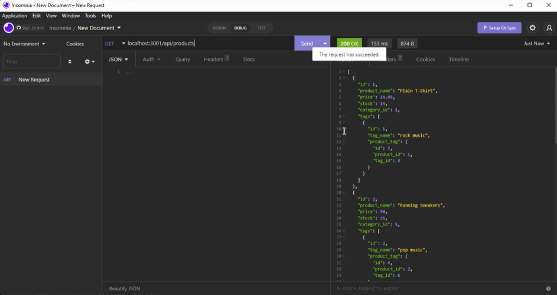

# Ecommerce Backend Application

  

## Description
  
  This application allows you to interact with an Ecommerce database to test POST, PUT, DELETE, and GET routes.
  
  
## Table of Contents
  
- [Ecommerce Backend Application](#ecommerce-backend-application)
  - [Description](#description)
  - [Table of Contents](#table-of-contents)
  - [Installation](#installation)
  - [Usage](#usage)
  - [Credits](#credits)
  - [License](#license)
  - [How to Contribute](#how-to-contribute)
  - [Tests](#tests)
  - [Questions](#questions)
  
  
## Installation
  
  To install this app, clone this repo, then install the dependencies by running "npm i" in the terminal.
  
  
## Usage
  
  To use this app, open MYSQL and run the schema.sql file. Once that is done, exit MYSQL and seed the database by running "node seeds/index.js." Once that is done, start you server by running "node server.js." Then you can open Insomnia to test the routes and the URL localhost:3001/api/'route endpoint'.

  
      
  
## Credits
  
  N/A
  
  
## License
  
  This software is licensed under the MIT license.
  
  ---
  
  
## How to Contribute
  
  N/A
  
  
## Tests
  
  N/A
  
  
## Questions
  
  Please forward any and all questions to benjaminmichaelday@gmail.com
  
  GitHub username: benmday